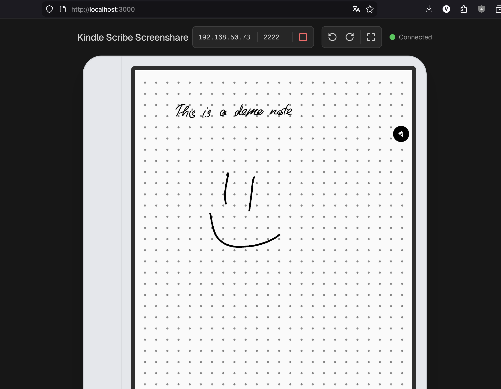

# Kindle Scribe Screen Sharing

Simple screen sharing application for Kindle Scribe that allows viewing the screen of it from a web browser.

## Demo

## Requirements:
- Jailbroken Kindle Scribe(required)
- Koreader(or another way of running ssh)
- Laptop or PC with [Node.js](https://nodejs.org/en)
- ffmpeg installed

## Instruction:
1. Enable ssh in Koreader and add your public key to authorized_keys
2. Run `npm install` and `npm run dev`
3. Open `http://localhost:3000` in your browser
4. Check your Kindle's IP address
5. In UI, enter your Kindle's IP address and port of ssh server(default in Koreader is 2222)
6. Click the Green Icon

> [!IMPORTANT]
> Tested on a first-gen Kindle Scribe and MacOS. This was mostly created using AI, any sort of contributions are welcome.

## Support me:
[Donatello(Ukrainian service)](https://donatello.to/k4rnaj1k)

## License

[MIT](LICENSE)